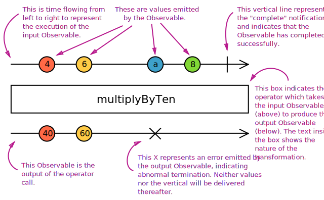

# Curso RXJS - Cod3r

## Curso de Javascript Funcional e Reativo

- Padrão Observer: Orientado a eventos
- Elementos: Event, Subject e Observer

O Observer registra no Subject que tem interesse no Event;

    Observer > Subject

O Subject passa a detectar quando o evento ocorre e notifica o Observer.

    detecta Event < Subject > notifica Observer

Marble Diagram Anatomy
 

